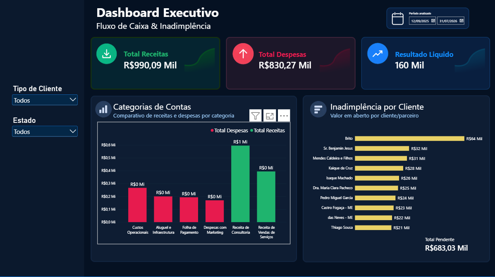

 # 📊 Executive Financial & Risk Analytics Dashboard

> Um pipeline de dados end-to-end e dashboard executivo desenvolvido para monitoramento de fluxo de caixa, DRE gerencial e controle de inadimplência corporativa.

---

## 🚀 Sobre o Projeto
Este projeto foi construído com foco em **Engenharia e Análise de Dados**, simulando um ambiente corporativo real onde dados transacionais brutos são tratados, estruturados em um banco de dados relacional e transformados em inteligência de negócio acionável através de um dashboard executivo no Power BI.

---

## 🛠️ Tecnologias e Arquitetura
A solução foi desenvolvida utilizando uma arquitetura moderna e leve:

* **Python (ETL):** Extração, tratamento de dados, normalização de formatos decimais e cargas automatizadas.
* **SQLite (Banco de Dados Relacional):** Armazenamento estruturado das tabelas transacionais e cadastrais (Star Schema simplificado).
* **Power BI & DAX:** Modelagem de dados, tratamento de localidade via Power Query, criação de medidas customizadas e design de interface (UI/UX corporativo).

---

## 📈 Funcionalidades e Regras de Negócio Implementadas

* **Visão de Fluxo de Caixa (KPIs Executivos):** Acompanhamento em tempo real de *Total de Receitas*, *Total de Despesas* e *Resultado Líquido*, com formatação condicional dinâmica.
* **Gestão de Inadimplência:** 
  * Classificação e isolamento de títulos pendentes e vencidos, separando o risco real de calote da carteira a vencer.
  * Ranking dinâmico de clientes/parceiros com maior volume financeiro em aberto.
* **Filtros e Segmentações Avançadas:** 
  * Filtro temporal flexível baseado em `data_vencimento`.
  * Segmentações laterais por *Tipo de Cliente* e *Estado* para análise regional e de segmentação de mercado.
* **Padronização Visual (UI/UX):** Layout em tema escuro (*Dark Mode*) voltado para redução de fadiga visual em ambientes executivos, com separação cromática semântica (Verde para Entradas/Receitas, Vermelho para Saídas/Despesas).

---

## 📸 Pré-visualização do Dashboard


> 

---

## ⚙️ Como Executar o Projeto

1. Clone o repositório:
   ```bash
   git clone https://github.com/matheuz2002/dashboard-financeiro-python-powerbi.git
